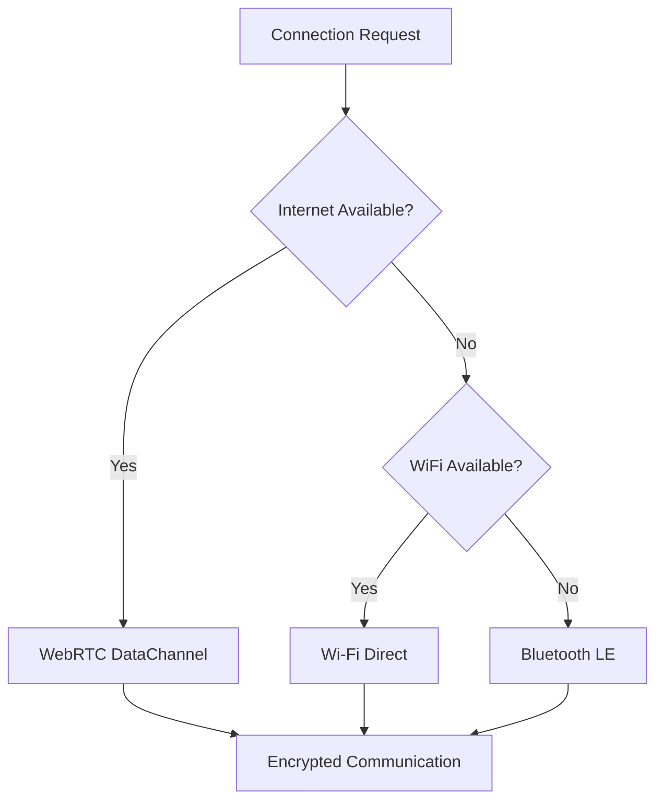

# 📜 SilentMesh: Ultra-Private Decentralized P2P Chat

<div align="center">

[](https://github.com/yourusername/silentmesh)
[](https://github.com/yourusername/silentmesh)
[](https://flutter.dev)
[](LICENSE)

_"The network that whispers in silence"_

**Zero-server • Zero-trace • Zero-compromise**

[Features](#-key-features) • [Architecture](#-architecture) • [Installation](#-installation) • [Roadmap](#-roadmap) • [Contributing](#-contributing)

</div>

---

## 🎯 Overview

**SilentMesh** is an ultra-secure, peer-to-peer encrypted messaging application designed for users who demand absolute privacy. With no central servers, no data retention, and forensic-resistant architecture, SilentMesh ensures your conversations remain truly private.

### Why SilentMesh?

- 🔒 **No Server, No Logs** - Direct peer-to-peer communication
- 🛡️ **Forensic Resistant** - Plausible deniability with decoy mode
- 🔐 **Military-Grade Encryption** - XChaCha20-Poly1305 with X25519 key exchange
- 👻 **Self-Destructing** - Automatic data wipe on compromise detection
- 🌐 **Multi-Transport** - WebRTC, Wi-Fi Direct, and Bluetooth LE
- 📱 **Cross-Platform** - Flutter-based mobile and desktop support

---

## ✨ Key Features

### 🛡️ Device Integrity Protection

SilentMesh performs comprehensive environment checks before launching:

| Security Check        | Implementation                                               |
| :-------------------- | :----------------------------------------------------------- |
| **Device Lock**       | Requires PIN/Pattern/Fingerprint via `KeyguardManager`       |
| **Bootloader Status** | Verifies locked bootloader through Play Integrity API        |
| **Root Detection**    | Checks for `su` binaries, Magisk, and `/system` write access |
| **Debug Mode**        | Enforces USB debugging to be disabled                        |

> ⚠️ **Strict Policy**: Application will force close and wipe data if any check fails.

### 👻 Anti-Forensic Features

#### Plausible Deniability

- **Dual-Password System**:
  - Real password → Access actual encrypted chats
  - Distress password → Opens convincing dummy interface with fake conversations

#### Self-Destruct Mechanisms

Automatic data wipe triggered by:

- ❌ 5 consecutive failed login attempts
- 🔌 USB debugging connection detected while app is active
- ✍️ Application signature tampering detected
- 🆘 Manual panic button activation

#### Stealth Installation

- APK disguised as PDF/IMG/LOG files
- Optional stub installer for encrypted payload deployment

---

## 🏗️ Architecture

### Network Transport (Auto-Switching)


1. **Primary**: WebRTC DataChannel (NAT traversal capable)
2. **Fallback 1**: Wi-Fi Direct (offline, medium range)
3. **Fallback 2**: Bluetooth LE (close range, power efficient)

### 🤝 Serverless Handshake

No signaling server required - connection establishment via QR codes:

```
Device A: Generate Offer → Display QR Code
Device B: Scan QR → Generate Answer → Display QR Code
Device A: Scan QR → ✅ Connected
```

### 🔐 Cryptographic Stack

Built on modern NaCl/LibSodium primitives:

- **Key Exchange**: X25519 (ECDH)
- **Encryption**: XChaCha20-Poly1305 (AEAD)
- **Key Derivation**: HKDF
- **Future**: Double Ratchet (Signal Protocol) for Perfect Forward Secrecy

#### Message Format

```json
{
  "v": 2,
  "ts": 1732102200,
  "type": "chat",
  "payload": "base64(encrypted_ciphertext)",
  "nonce": "base64(unique_nonce)",
  "sender_id": "hash(public_key)"
}
```

---

## 🛠️ Technical Stack

### Technologies

- **Frontend**: Flutter (Dart)
- **Database**: SQLite with SQLCipher encryption
- **Key Storage**: Android Keystore + Argon2id KDF
- **Networking**: WebRTC, Wi-Fi Direct, Bluetooth LE
- **CLI/Desktop**: Python (optional)

### Project Structure

```
lib/
├── core/
│   ├── security/
│   │   ├── device_integrity.dart    # Root/ADB detection
│   │   ├── self_destruct.dart       # Data wiper
│   │   └── crypto_service.dart      # X25519/ChaCha20
│   └── transport/
│       ├── webrtc_manager.dart      # WebRTC implementation
│       └── wifi_direct_manager.dart # Wi-Fi Direct handler
├── data/
│   ├── local_storage/
│   │   ├── secure_vault.dart        # SQLCipher wrapper
│   │   └── dummy_generator.dart     # Decoy data generator
├── ui/
│   ├── screens/
│   │   ├── auth_gate.dart           # Authentication screen
│   │   ├── secret_chat.dart         # Real interface
│   │   └── dummy_chat.dart          # Decoy interface
│   └── widgets/
│       └── qr_scanner.dart          # QR handshake UI
└── main.dart
```

---

## 📥 Installation

### Prerequisites

```bash
flutter --version  # Flutter 3.0+
dart --version     # Dart 3.0+
```

### Build from Source

```bash
# Clone repository
git clone https://github.com/yourusername/silentmesh.git
cd silentmesh

# Install dependencies
flutter pub get

# Run security audit
flutter analyze

# Build release APK
flutter build apk --release --obfuscate --split-debug-info=./debug-info
```

### Stealth Installation

1. Rename built APK: `app-release.apk` → `document.pdf`
2. Transfer to device via secure channel
3. Rename back to `.apk` before installation
4. Enable "Install from Unknown Sources" temporarily
5. Disable after installation complete

---

## 🔒 Security Best Practices

### For Users

- ✅ Always use strong, unique passphrases (16+ characters)
- ✅ Set up distress password before first use
- ✅ Keep bootloader locked
- ✅ Disable USB debugging permanently
- ✅ Use device encryption
- ❌ Never root your device
- ❌ Don't install on emulators

### For Developers

```dart
// Example: Device integrity check
import 'package:flutter/services.dart';
import 'package:safe_device/safe_device.dart';

Future<bool> checkEnvironment() async {
  bool isRooted = await SafeDevice.isJailBroken;
  bool isRealDevice = await SafeDevice.isRealDevice;
  bool isAdbEnabled = await SafeDevice.isDevelopmentModeEnable;

  if (isRooted || isAdbEnabled || !isRealDevice) {
    await SelfDestruct.wipeLocalData();
    SystemNavigator.pop();
    return false;
  }
  return true;
}
```

---

## 🗓️ Roadmap

### Phase 1: The Core _(Week 1-2)_

- [ ] Flutter project setup & architecture
- [ ] X25519 key generation implementation
- [ ] WebRTC DataChannel + QR signaling
- [ ] Basic encrypted messaging

### Phase 2: The Vault _(Week 3)_

- [ ] SQLCipher integration
- [ ] Dual-password authentication system
- [ ] Root & ADB detection mechanisms
- [ ] Dummy data generator

### Phase 3: The Stealth _(Month 1)_

- [ ] Self-destruct logic implementation
- [ ] Wi-Fi Direct & Bluetooth fallback
- [ ] Security audit & penetration testing
- [ ] Documentation completion

### Phase 4: The Evolution _(Future)_

- [ ] Double Ratchet (Perfect Forward Secrecy)
- [ ] Group messaging support
- [ ] Desktop clients (Windows, macOS, Linux)
- [ ] Tor integration option

---

## 🤝 Contributing

We welcome contributions! Please read our [Contributing Guidelines](CONTRIBUTING.md) first.

### Development Setup

```bash
# Fork and clone
git clone https://github.com/yourusername/silentmesh.git

# Create feature branch
git checkout -b feature/amazing-feature

# Make changes and test
flutter test

# Commit using conventional commits
git commit -m "feat: add amazing feature"

# Push and create PR
git push origin feature/amazing-feature
```

---

## ⚖️ Legal & Disclaimer

**SilentMesh is designed for legal privacy protection.**

- ⚠️ Users are responsible for compliance with local laws
- ⚠️ Not intended for illegal activities
- ⚠️ Export restrictions may apply in some jurisdictions
- ⚠️ No warranty provided - use at your own risk

---

## 📄 License

This project is licensed under the MIT License - see the [LICENSE](LICENSE) file for details.

---

## 🙏 Acknowledgments

- Signal Protocol for cryptographic inspiration
- LibSodium for robust crypto primitives
- Flutter community for amazing tools
- All privacy advocates worldwide

---

<div align="center">

**Built with 🔒 for those who value privacy**

[⬆ Back to Top](#-silentmesh-ultra-private-decentralized-p2p-chat)

</div>
